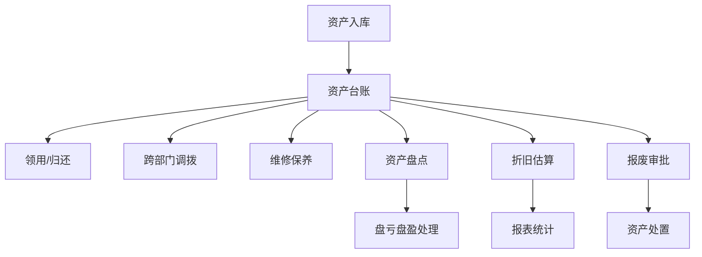

## 1. 产品概述

企业资产管理 Web 门户是面向分公司资产管理员的全生命周期管理系统，覆盖办公设备从采购到报废的完整流程。系统通过数字化手段提升资产管理效率，降低资产流失风险，实现资产全流程可追溯。

- 核心目标：实现资产全生命周期可视化管理，提升资产利用率
- 目标用户：分公司资产管理员、部门负责人、财务人员
- 产品价值：减少资产盘点误差 60%，缩短资产调拨流程 70%

## 2. 核心功能

### 2.1 用户角色

| 角色 | 登录方式 | 核心权限 |
|------|----------|----------|
| 资产管理员 | 账号密码登录 | 全部功能权限，包括资产增删改查、审批流程管理 |
| 部门员工 | 账号密码登录 | 查看个人资产、发起领用/归还申请 |
| 财务人员 | 账号密码登录 | 查看资产报表、折旧核算、报废审批 |

### 2.2 功能模块

1. **资产台账**：资产列表展示、筛选搜索、详情查看、批量操作
2. **入库登记**：单个入库、批量导入、资产编号生成、购置凭证上传
3. **领用归还**：领用申请、归还登记、使用人绑定、领用记录
4. **调拨申请**：跨部门调拨、调拨审批、调拨记录追踪
5. **维修工单**：维修登记、费用记录、保养提醒、维修历史
6. **盘点任务**：扫码盘点、盘亏盘盈处理、盘点报告
7. **报表中心**：折旧估算、资产统计、状态分析、数据导出

### 2.3 页面详情

| 页面名称 | 模块名称 | 功能描述 |
|----------|----------|----------|
| 资产台账 | 资产列表 | 表格展示所有资产，支持分页、排序、批量选择 |
| 资产台账 | 筛选搜索 | 按状态、分类、部门、使用人等多维度筛选 |
| 资产台账 | 资产详情 | 查看资产完整信息、操作日志、生命周期记录 |
| 资产台账 | 批量操作 | 批量导出、批量调拨、批量报废 |
| 入库登记 | 单个入库 | 表单录入资产信息，自动生成资产编号 |
| 入库登记 | 批量导入 | Excel 模板下载、批量导入、导入预览 |
| 入库登记 | 凭证上传 | 购置发票、合同等凭证上传管理 |
| 领用归还 | 领用申请 | 选择资产、填写领用事由、提交审批 |
| 领用归还 | 归还登记 | 资产归还、状态更新、归还记录 |
| 领用归还 | 使用记录 | 历史使用人、使用时长统计 |
| 调拨申请 | 发起调拨 | 选择资产、目标部门、调拨原因 |
| 调拨申请 | 调拨审批 | 待审批列表、审批操作、审批意见 |
| 调拨申请 | 调拨记录 | 历史调拨记录、状态追踪 |
| 维修工单 | 维修登记 | 故障描述、维修服务商、预计费用 |
| 维修工单 | 费用管理 | 维修费用登记、费用统计 |
| 维修工单 | 保养提醒 | 保养周期设置、到期提醒 |
| 盘点任务 | 创建任务 | 盘点范围选择、盘点方式设置 |
| 盘点任务 | 扫码盘点 | 二维码/条形码扫描、实盘登记 |
| 盘点任务 | 差异处理 | 盘亏盘盈登记、差异原因说明 |
| 报表中心 | 资产概览 | 资产总数、价值、状态分布图表 |
| 报表中心 | 折旧估算 | 折旧方法选择、月度折旧计算 |
| 报表中心 | 数据导出 | 多格式导出、自定义导出字段 |

## 3. 核心流程

### 3.1 资产入库流程

资产管理员录入资产信息 → 系统自动生成资产编号 → 上传购置凭证 → 资产入库台账 → 绑定存放位置

### 3.2 资产领用流程

员工发起领用申请 → 资产管理员审核 → 资产状态更新为"在用" → 绑定使用人 → 记录领用时间

### 3.3 资产调拨流程

发起跨部门调拨申请 → 调出部门审批 → 调入部门确认 → 资产归属部门更新 → 记录调拨历史

### 3.4 资产盘点流程

创建盘点任务 → 生成盘点清单 → 扫码/人工盘点 → 系统比对差异 → 盘亏盘盈处理 → 生成盘点报告

### 3.5 资产报废流程

提交报废申请 → 技术鉴定 → 财务审核 → 领导审批 → 资产状态更新为"报废" → 资产处置记录

## 4. 用户界面设计

### 4.1 设计风格

- **主色调**：深海蓝 (#1e3a5f) 作为主色，体现专业稳重
- **辅助色**：科技蓝 (#3b82f6) 用于交互元素，青绿色 (#10b981) 表示成功状态
- **警示色**：琥珀色 (#f59e0b) 提醒状态，玫红色 (#ef4444) 错误/危险状态
- **中性色**：石板灰系列，确保信息层次清晰

- **按钮风格**：圆角 6px，主按钮渐变背景，悬停有微动效
- **字体**：Inter 作为主要字体，配合思源黑体确保中文显示
- **布局风格**：左侧导航 + 顶部工具栏 + 内容区域的经典企业后台布局
- **卡片风格**：浅灰色边框 + 微妙阴影，悬停时阴影加深

- **图标风格**：Lucide 线性图标，统一 20px 尺寸
- **数据展示**：表格 + 卡片混合布局，关键指标突出显示

### 4.2 页面设计概览

| 页面名称 | 模块名称 | UI 元素 |
|----------|----------|---------|
| 资产台账 | 顶部筛选栏 | 搜索框、状态筛选下拉、分类筛选、部门筛选 |
| 资产台账 | 数据表格 | 资产编号、名称、分类、状态、使用人、部门、位置、价值 |
| 资产台账 | 操作列 | 查看、编辑、调拨、维修、报废快捷操作 |
| 入库登记 | 入库表单 | 分组表单、自动编号、文件上传组件 |
| 入库登记 | 批量导入 | 拖放上传区域、导入进度、数据预览表格 |
| 领用归还 | 标签切换 | 待领用、领用中、已归还三个标签页 |
| 调拨申请 | 申请列表 | 卡片式列表，显示调拨状态进度条 |
| 维修工单 | 工单看板 | 待处理、维修中、已完成三列看板 |
| 盘点任务 | 任务卡片 | 任务状态、进度环、开始/结束时间 |
| 报表中心 | 图表区域 | 饼图、柱状图、折线图组合展示 |
| 报表中心 | 统计卡片 | 关键指标卡片，带趋势箭头 |

### 4.3 响应式

- 桌面端优先设计，适配 1366px 及以上屏幕
- 平板端：侧边栏可折叠，表格支持横向滚动
- 移动端：简化导航，卡片式布局优先，扫码功能优化触控体验

### 4.4 动效设计

- 页面切换：淡入 + 轻微上移动画，200ms 时长
- 表格行：悬停时背景色渐变过渡
- 模态框：缩放 + 淡入效果
- 状态标签：状态变更时颜色过渡动画
- 数据加载：骨架屏脉冲动画
