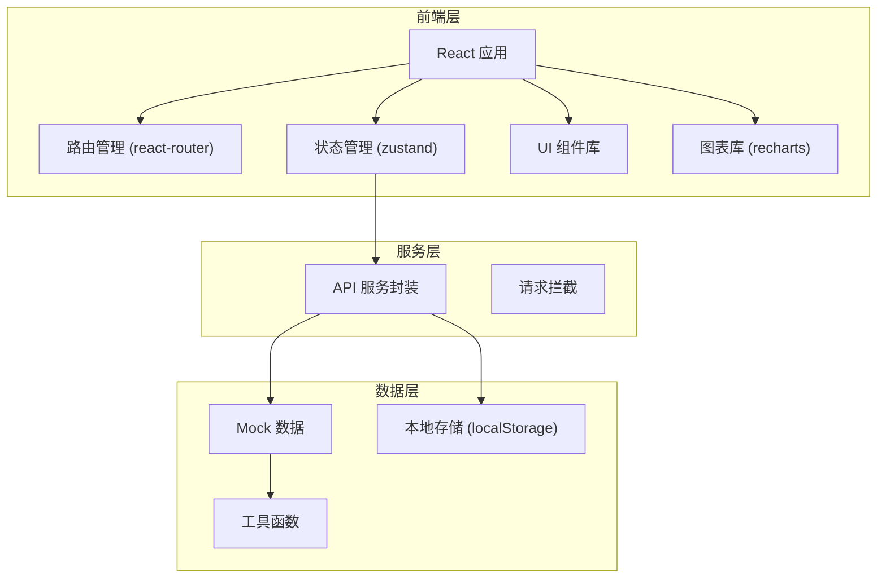
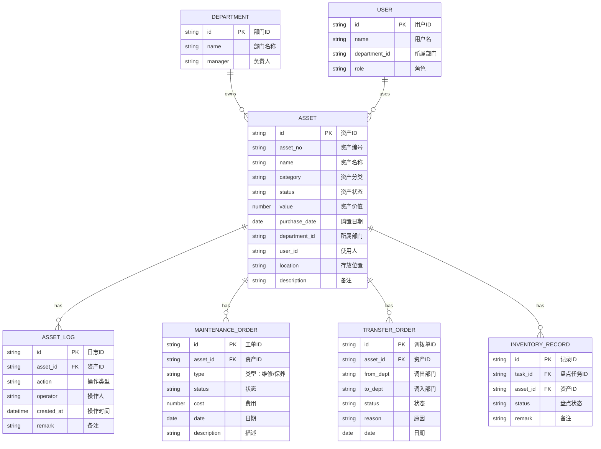

## 1. 架构设计



## 2. 技术描述

- **前端框架**：React 18 + TypeScript
- **构建工具**：Vite 5.x
- **CSS 方案**：Tailwind CSS 3.x
- **路由管理**：react-router-dom v6
- **状态管理**：zustand
- **图标库**：lucide-react
- **图表库**：recharts
- **UI 组件**：基于 Tailwind 自定义组件
- **数据模拟**：Mock 数据 + localStorage 持久化

## 3. 路由定义

| 路由路径 | 页面名称 | 说明 |
|----------|----------|------|
| /assets | 资产台账 | 资产列表展示、筛选、搜索 |
| /assets/:id | 资产详情 | 资产详细信息、操作日志 |
| /warehousing | 入库登记 | 单个入库、批量导入 |
| /usage | 领用归还 | 领用申请、归还登记 |
| /transfer | 调拨申请 | 跨部门调拨管理 |
| /maintenance | 维修工单 | 维修登记、保养提醒 |
| /inventory | 盘点任务 | 盘点任务、扫码盘点 |
| /reports | 报表中心 | 统计报表、折旧估算 |

## 4. 数据模型

### 4.1 数据模型定义



### 4.2 资产状态枚举

| 状态值 | 显示名称 | 说明 |
|--------|----------|------|
| idle | 闲置 | 在库未使用 |
| in_use | 在用 | 已领用使用中 |
| maintenance | 维修中 | 送修或保养中 |
| transferred | 调拨中 | 跨部门调拨流程中 |
| scrapped | 已报废 | 已完成报废流程 |
| lost | 盘亏 | 盘点确认丢失 |

### 4.3 资产分类

- 办公设备：电脑、打印机、投影仪等
- 办公家具：办公桌、办公椅、文件柜等
- 电子设备：手机、平板、相机等
- 车辆资产：公务用车
- 其他：其他类资产

## 5. 目录结构

```
src/
├── assets/              # 静态资源
├── components/          # 公共组件
│   ├── layout/         # 布局组件
│   │   ├── Sidebar.tsx
│   │   ├── Header.tsx
│   │   └── Layout.tsx
│   ├── ui/             # UI 基础组件
│   │   ├── Button.tsx
│   │   ├── Input.tsx
│   │   ├── Modal.tsx
│   │   ├── Table.tsx
│   │   ├── Badge.tsx
│   │   ├── Card.tsx
│   │   ├── Tabs.tsx
│   │   └── Select.tsx
│   └── charts/         # 图表组件
├── pages/              # 页面组件
│   ├── AssetList/      # 资产台账
│   ├── Warehousing/    # 入库登记
│   ├── Usage/          # 领用归还
│   ├── Transfer/       # 调拨申请
│   ├── Maintenance/    # 维修工单
│   ├── Inventory/      # 盘点任务
│   └── Reports/        # 报表中心
├── store/              # 状态管理
│   └── useAssetStore.ts
├── data/               # Mock 数据
│   ├── assets.ts
│   ├── departments.ts
│   └── users.ts
├── types/              # TypeScript 类型
│   └── index.ts
├── utils/              # 工具函数
│   ├── assetNo.ts      # 资产编号生成
│   ├── depreciation.ts  # 折旧计算
│   ├── format.ts       # 格式化函数
│   └── storage.ts      # 本地存储
├── hooks/              # 自定义 Hooks
├── router/             # 路由配置
│   └── index.tsx
├── App.tsx
├── main.tsx
└── index.css
```

## 6. 关键技术点

### 6.1 资产编号生成规则

```
格式：{公司代码}-{分类代码}-{年份}-{序号}
示例：BJT-IT-2024-0001
- 公司代码：3位字母，如 BJT（北京分公司）
- 分类代码：2位字母，如 IT（信息技术）
- 年份：4位数字
- 序号：4位数字，自动递增
```

### 6.2 折旧计算方法

- **直线法**：月折旧额 = (原值 - 残值) / (使用年限 × 12)
- **双倍余额递减法**：加速折旧计算
- 默认使用直线法，残值率 5%

### 6.3 本地存储策略

- 使用 localStorage 持久化数据
- 关键数据：资产列表、用户信息、操作日志
- 数据变更时自动同步到 localStorage
- 页面加载时从 localStorage 恢复数据

### 6.4 性能优化

- 列表虚拟滚动（大数据量）
- 组件 memo 优化
- 图片懒加载
- 路由懒加载
